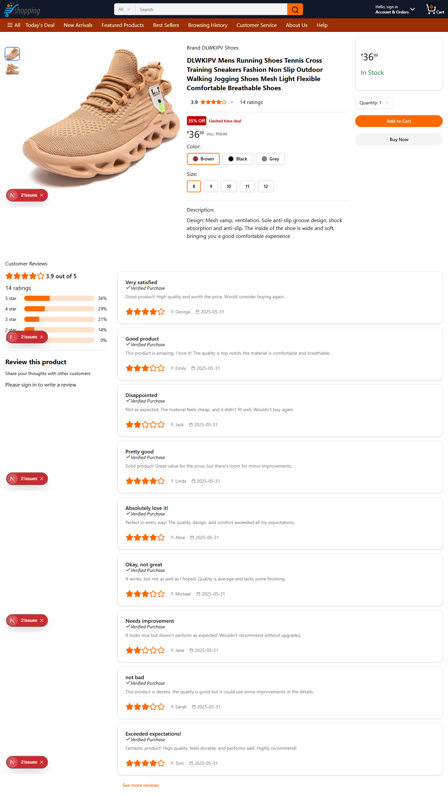
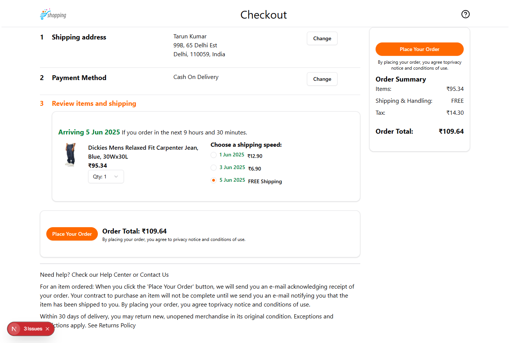

## Getting Started

First, run the development server:

```bash
npm run dev
# or
yarn dev
# or
pnpm dev
# or
bun dev
```

# 🛒 Modern eCommerce Web App

A fully responsive and feature-rich eCommerce application built with the latest technologies including **Next.js 15**, **React 19**, **MongoDB**, **Tailwind CSS**, and **Shadcn UI**.

---

## 🚀 Tech Stack

- **Next.js 15** – App Router, Server Actions, SSR
- **React 19** – Leveraging the latest features
- **MongoDB** – NoSQL Database for storing users, products, and orders
- **Tailwind CSS** – Utility-first CSS framework for rapid UI styling
- **Shadcn UI** – Accessible and themeable UI components

---

## 🎬 Tutorial Reference

This project is based on the YouTube tutorial by **Code With Yousaf**. You can watch the full video here:

🔗 [Watch on YouTube](https://www.youtube.com/watch?v=s6bJbikLnKM&t=22852s)

---

## 🖼️ Screenshots

### 🏠 Homepage


---

### 🛍️ Product


---

### 💳 Checkout Page


---

## 📦 Features

- 🔐 User Authentication (Login/Signup)
- 🛍️ Product Browsing with Categories
- 🧺 Cart Management
- 💳 Checkout Flow

---

